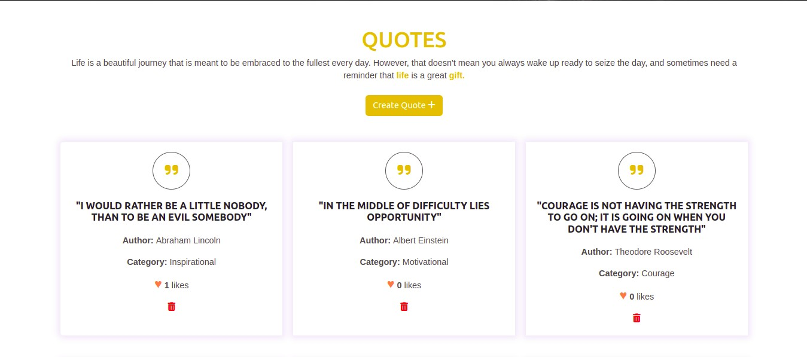
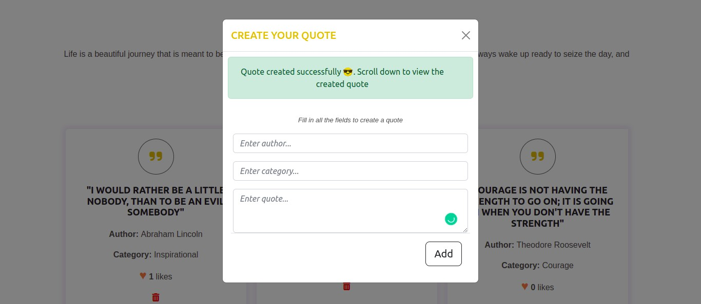
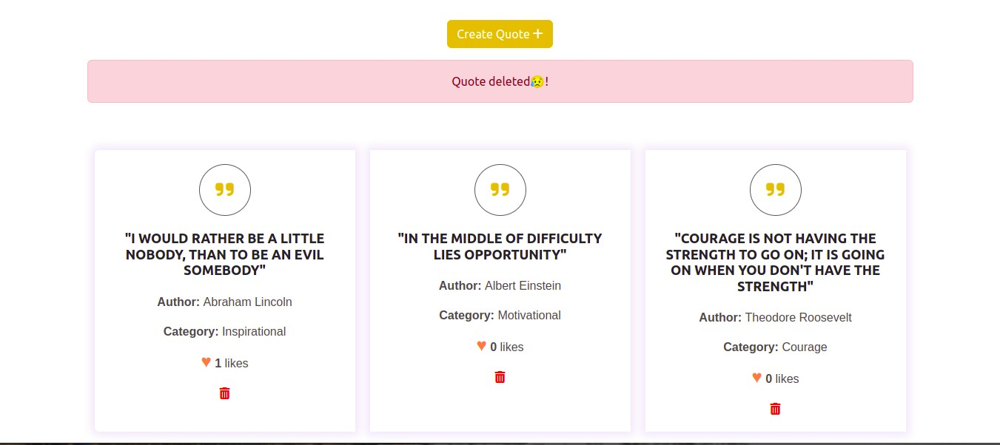
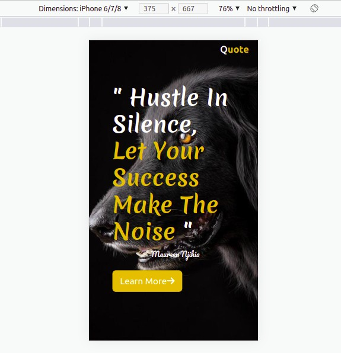

# Quotes Website
# Contributors of this Project
## By Maureen Njihia on 1st September 2022
# Description
Moringa Phase 1 Independent Project on a Quotes website that allows users to:
* View all quoes `GET/quotes`
* Create their own quote `POST/quotes`
* Like a quote `PATCH/quotes/:id`
* Delete a quote `DELETE/quotes/:id`
# Setup Requirements
* Git
* Github
* Web Browser (Chrome or Firefox)
* Node.js https://nodejs.org/en/
* JSON Server https://www.npmjs.com/package/json-server
# Setup Installation
* Copy the link of this repository
```
https://github.com/Njihia413/Phase-1-Project.git
```
* Clone it to your local machine
```
git clone https://github.com/Njihia413/Phase-1-Project.git
```
* Open terminal and navigate to the directory of the project
```
cd Phase-1-Project
```
* Run the following command to install the JSON Server
```
npm install -g json-server
```
* Start the JSON Server
```
json-server --watch db.json
```
* To view the server, navigate to http://localhost:3000/quotes
* To run the application, oprn the `index.html` file on your browser.
# Technologies Used
* HTML5
* CSS3
* Bootstrap 5.2
# Some Screenshots
* Homepage

* Quotes Section

* Create Quote Modal Form

* After submitting the form

* After Deleting a Quote


* Fully Phone Responsive
# Known Bugs
There are no known bugs of this project at the moment 😎
# Support and contact details
For any contributions towards this project:
* Email: developer.njihia@gmail.com
* Phone: 0704592362
# License
Copyright (c) 2022 Moringa School

Permission is hereby granted, free of charge, to any person obtaining
a copy of this software and associated documentation files (the
"Software"), to deal in the Software without restriction, including
without limitation the rights to use, copy, modify, merge, publish,
distribute, sublicense, and/or sell copies of the Software, and to
permit persons to whom the Software is furnished to do so, subject to
the following conditions:

The above copyright notice and this permission notice shall be
included in all copies or substantial portions of the Software.

THE SOFTWARE IS PROVIDED "AS IS", WITHOUT WARRANTY OF ANY KIND,
EXPRESS OR IMPLIED, INCLUDING BUT NOT LIMITED TO THE WARRANTIES OF
MERCHANTABILITY, FITNESS FOR A PARTICULAR PURPOSE AND
NONINFRINGEMENT. IN NO EVENT SHALL THE AUTHORS OR COPYRIGHT HOLDERS BE
LIABLE FOR ANY CLAIM, DAMAGES OR OTHER LIABILITY, WHETHER IN AN ACTION
OF CONTRACT, TORT OR OTHERWISE, ARISING FROM, OUT OF OR IN CONNECTION
WITH THE SOFTWARE OR THE USE OR OTHER DEALINGS IN THE SOFTWARE.